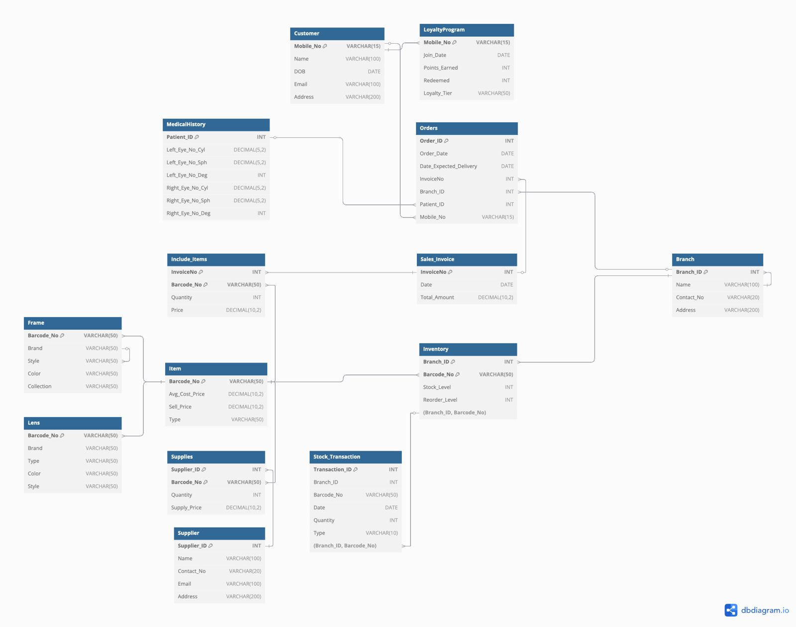

# Optitrack-CRM
Optitrack Database project

This project is a relational database schema designed to manage operations of an optical retail business. It handles customers, orders, inventory, medical history, loyalty programs, suppliers, and stock transactions across multiple branches.

## 📌 Project Overview

The database system enables efficient tracking and integration of:
- Customer details and medical history
- Optical product inventory (lenses, frames)
- Sales and order management
- Branch-level stock tracking
- Supplier information and restocking
- Loyalty and rewards program

The ERD (Entity-Relationship Diagram) has been designed using **dbdiagram.io** and includes all primary relationships, foreign keys, and constraints necessary to support real-world operations in an optical retail chain.

---

## 🧩 Entity Descriptions

### 🧑‍💼 Customer
Stores basic information about customers, including contact, DOB, and address.

### 📄 MedicalHistory
Captures the customer's eye prescription data for both eyes.

### 🛍️ Orders
Tracks order placement, delivery date, associated customer and branch.

### 🧾 Sales_Invoice
Stores invoice details such as total amount and date.

### 📦 Include_Items
Links each invoice with the items purchased, including quantity and price.

### 🧑‍⚕️ LoyaltyProgram
Tracks customer loyalty points, tier, and redemption.

### 🕶️ Item, Frame, Lens
Defines all retail products with details such as style, brand, and price.

### 📍 Branch
Contains information for each retail branch location.

### 📊 Inventory
Maintains stock levels and reorder thresholds per branch.

### 🔁 Stock_Transaction
Records stock movements including additions and removals by transaction type.

### 🚚 Supplier & Supplies
Stores supplier details and the products they supply to branches.

---

## 🧱 Schema Diagram

The ERD diagram is included in the `docs/` folder as a high-resolution PNG file.

---

## 🛠️ Technologies Used

- **MySQL / PostgreSQL** (Compatible)
- **dbdiagram.io** (for ERD design)
- SQL DDL (for schema creation)

---

